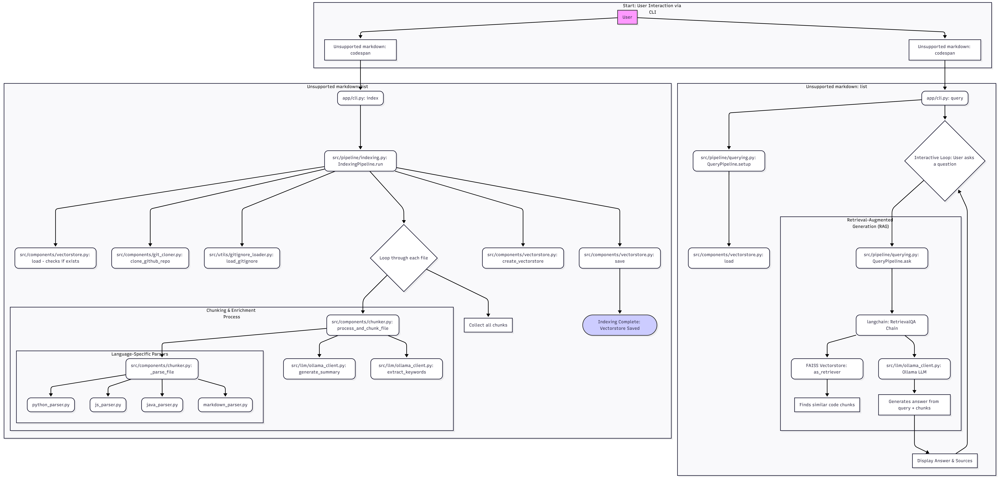

# AI-DevAssistant

Your AI-powered code development assistant

  
  
  

## Overview

AI-DevAssistant is an AI-powered developer tool that helps you quickly understand and navigate large codebases.

It works by dynamically cloning GitHub repositories, chunking and vectorizing the code, and then applying a Retrieval-Augmented Generation (RAG) architecture to answer your queries with relevant code context.

Designed for developers working with large or unfamiliar repositories, AI-DevAssistant reduces the time spent searching through files and helps you focus on building and problem-solving.

## Flowchart

### Basic Project Flow



## Features

- Clone GitHub repos dynamically

- Parse Python/JS/Java code + docs

- Chunk + store with metadata

- Vectorize (embeddings)

- Query with LLM (future scope)

## Folder Structure

```
AI-DevAssistant/
│── data/                  # Stores generated chunks
│── repos/                 # Cloned repositories
│── src/                   # Source code
│   │── ingest.py          # Handles chunking pipeline
│   │── vectorize.py       # Handles embedding/vectorization
│   │
│   ├── parsers/           # Language-specific parsers
│   │   ├── js_parser.py
│   │   ├── java_parser.py
│   │   ├── python_parser.py
│   │   └── markdown_parser.py
│   │
│   └── utils/             # Utility functions
│       ├── github_cloner.py
│       ├── gitignore_loader.py
│       └── metadata.py
│
│── assets/                # Flowchart, diagrams
│── requirements.txt
│── README.md
│── .gitignore
```

## Installation

```
*git clone https://github.com/yourusername/AI-DevAssistant.git
cd AI-DevAssistant
python -m venv venv
source venv/bin/activate   # or venv\Scripts\activate on Windows
pip install -r requirements.txt
```

## Usage

```
python src/ingest.py
```
For now the project only clones the repo and chunks all the functions and store it in data/chunks.json

## Pending work

- Vectorizing chunks before storing.

- Integrate FAISS/Chroma for vector search

- Add query interface

## Challenges to solve

Currently, the system chunks code only at the function level. While this is useful for capturing self-contained logic, it isn’t always optimal for retrieval.

For example, if a developer queries:

“Where is the logic for xyz handled?”

The answer might span multiple smaller functions, class definitions, or even cross-file interactions. In such cases:

- The retriever may return only the function where xyz is directly mentioned.

- Supporting context (helper functions, related classes, configuration logic) might be missed.

- This can lead to incomplete or misleading answers.

### Why This Matters

Real-world repos are rarely structured so neatly that one function equals one logical unit. Complex features often:

- Depend on multiple helper functions.

- Are spread across different files (e.g., controller → service → database layer).

- Require docstrings, comments, or README references to fully explain.

### Future Direction

A better approach could combine:

- Hierarchical chunking (functions + surrounding context like classes or files).

- Hybrid retrieval (code + markdown/docs).

- Query-aware dynamic chunk expansion (returning related code pieces instead of isolated functions).

### Alternative Approach: Semantic-Aware Chunking with LLMs

Instead of relying only on function-level chunking, each chunk can be immediately summarized or described by a local LLM at the time of ingestion.

*Workflow*:

1. Code is split into chunks (functions, classes, or fallback text).

2. Each chunk is passed to a local LLM (or lightweight summarizer) to generate:

	- A plain-English description of what the chunk does.

	- Key entities (functions, classes, variables, APIs).

	- Potential relationships with other chunks.

3. Both the raw code and its semantic description are stored together in the vector database.

*Advantages:*

- Improves retrieval when queries are high-level (“Where is the login validation handled?”) instead of exact code matches.

- Helps bridge the gap between natural language queries and raw code.

- Makes the system more explainable and friendly for developers who don’t want to dig through code.

*Implementation Considerations:*

- Can be parallelized with multiprocessing or multithreading to keep ingestion fast.

- Summarization step can be optional/configurable, depending on compute resources.

- Works best with local lightweight models (e.g., LLaMA, Mistral, Phi) for privacy and speed.

