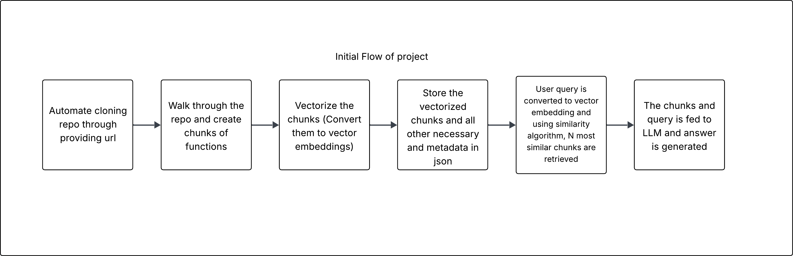

# 🧠Repo-gnition

Your AI-powered copilot for understanding and navigating complex codebases. Ask questions in natural language and get answers with direct source code citations.

  
  


## Overview

Repo-gniton is a command-line tool designed to help developers quickly get up to speed with large or unfamiliar codebases. It leverages a Retrieval-Augmented Generation (RAG) architecture to provide accurate, context-aware answers to your questions.

Instead of manually searching through files, you can simply ask questions like, "How is user authentication handled?" or "Where is the database connection configured?", and the assistant will find the relevant code snippets and explain them.

## 🚀 How It Works

The tool operates in two main phases:

### 1. Indexing:

The assistant first builds a knowledge base from a given GitHub repository.

- Clone: It clones the repository to your local machine.

- Parse & Chunk: It intelligently parses the source code (supporting Python, Java, JavaScript, and Markdown) into meaningful chunks, like functions or classes.

- Enrich: Each chunk is enriched with a summary and keywords generated by a local Large Language Model (LLM) via Ollama.

- Vectorize: These enriched chunks are converted into numerical representations (embeddings) and stored in a local FAISS vector database for efficient searching.

### 2. Querying:

Once a repository is indexed, you can start an interactive chat session.

- Retrieve: When you ask a question, the tool converts it into an embedding and searches the vector database to find the most relevant code chunks.

- Generate: The retrieved chunks and your original question are passed to the LLM, which generates a comprehensive answer.

- Cite: The answer is presented to you along with the source file and line numbers for each code chunk used, allowing you to jump directly to the relevant code.

## Flowchart

### Basic Project Flow



### Detailed Flowchart

For very deep and detailed interaction and pipeline of the project check [this](assets/flowchart.png) out.

## ✨ Features

- Dynamic Repo Cloning: Clones any public GitHub repository.

- Multi-Language Support: Parses Python, Java, JavaScript, and Markdown files.

- Intelligent Code Chunking: Breaks down code into logical blocks like functions and classes.

- Semantic Enrichment: Uses an LLM to generate summaries and keywords for better retrieval.

- RAG-Powered Q&A: Provides accurate, context-aware answers using a state-of-the-art RAG pipeline.

- Source Code Citations: Every answer includes precise file and line number references.

- Local First: Leverages local models via Ollama for privacy and offline use.

## 🛠 Prerequisites

Before you begin, you need to have Ollama installed and running with a model that can be used for both embeddings and generation.

### 1. Install Ollama:

Follow the instructions at https://ollama.com/.

### 2. Pull a Model:

It's recommended to pull a coding-specific model. The default in the configuration is `qwen2.5-coder:latest`.

```bash
ollama pull qwen2.5-coder:latest
```

### 3. Pull an Embedding Model:

The default embedding model is `nomic-embed-text`.

```bash
ollama pull nomic-embed-text
```

## 🛠 Installation

### 1. Clone the Repository

```bash
git clone https://github.com/trippynix/repognition.git
cd repognition
```

### 2. Create and Activate a Virtual Environment

```bash
python -m venv venv
source venv/bin/activate  # On Windows, use `venv\Scripts\activate`
```

### 3. Install Dependencies and the CLI Tool

Installing with `-e .` makes the `repognition` command available in your terminal.

```bash
pip install -e .
```

## 💻 Usage

The tool has two main commands: index and query.

### Option 1: Run the Streamlit Web Interface (Recommended)

This is the easiest way to interact with the assistant.

### 1.1. Launch the app:

```bash
streamlit run app/main.py
```

### 1.2. Open your browser:

The command will open a new tab in your web browser.

### 1.3. Interact:

Use the sidebar to enter a GitHub URL and index the repository. Once indexing is complete, you can ask questions in the main chat window.

### Option 2: Use the Command-Line Interface (CLI)

For command-line users, the original CLI is still available for scripting or headless environments.

### 2.1. Index a Repository

First, you must index the repository you want to query. This process may take a few minutes depending on the size of the repository and your hardware.

```bash
repognition index <github_url>
```

### Example:

```bash
repognition index https://github.com/langchain-ai/langchain
```

You will see a progress output as it processes each file. Once complete, a vector store will be saved locally in the `data/` directory.

### 2.2. Query a Repository

After indexing, you can start an interactive query session.

```bash
repogniton query <github_url>
```

### Example:

```bash
repogniton query https://github.com/langchain-ai/langchain
```

This will launch an interactive prompt. Ask your questions and type `exit` to quit.

```bash
🤔 Starting query session for: https://github.com/langchain-ai/langchain
QA chain is ready.
💡 Ask a question. Type 'exit' to quit.

> How does the base retriever work?

💬 Answer:
The base retriever is an abstract class that defines the interface for all retrievers... [Detailed answer from the LLM]

📚 Sources:
  - libs/langchain/langchain/schema/retriever.py (Lines: 15-45)
  - libs/core/langchain_core/retrievers.py (Lines: 20-60)

> exit
```

## Configuration

You can customize the models and paths in `config/settings.py`.

- `EMBEDDING_MODEL`: The Ollama model to use for generating embeddings.

- `LLM_MODEL`: The Ollama model to use for generating answers.

- `REPOS_DIR`, `DATA_DIR`: Directories for storing cloned repos and vector stores.

## Folder Structure

```
repogniton/
├── app/
│   └── cli.py              # Typer-based command-line interface
├── config/
│   └── settings.py         # Project configuration
├── src/
│   ├── components/         # Core building blocks
│   │   ├── chunker.py      # File processing and chunking logic
│   │   ├── git_cloner.py   # Clones GitHub repositories
│   │   └── vectorstore.py  # Manages the FAISS vector store
│   ├── llm/
│   │   └── ollama_client.py# Handles communication with the Ollama API
│   ├── parsers/            # Language-specific parsing modules
│   ├── pipeline/
│   │   ├── indexing.py     # Orchestrates the indexing workflow
│   │   └── querying.py     # Orchestrates the Q&A workflow
│   └── utils/
│       └── gitignore_loader.py # Utility to parse .gitignore files
├── .gitignore
├── LICENSE
├── README.md
├── requirements.txt
└── setup.py                # Project setup and installation script
```

## 🧠 Challenges and Future Enhancements

This project provides a solid foundation for an AI code assistant, but there are several exciting challenges to tackle to make it truly intelligent. Here are the key areas for future development:

### 1. The "Lost in the Woods" Problem: Lack of Structural Awareness

- **The Challenge**: Currently, the system treats a repository as a "bag of functions." It understands the content of files but lacks a conceptual map of the folder structure. When asked, "What are the main components?", it retrieves individual functions rather than explaining that the components reside in the `src/components/` directory.

- **Future Enhancement**: Implement a structural representation of the codebase, perhaps as a graph or tree, during the indexing phase. This would allow the LLM to answer questions about the project's layout, making it aware of the relationships between files and directories.

### 2. The "Single Puzzle Piece" Problem: Limited Long-Context Awareness

- **The Challenge**: The RAG model excels at finding relevant, isolated chunks of code but struggles to understand the sequence of operations between them. When asked, "How does the indexing pipeline work?", it might retrieve the `run()`, `clone_github_repo()`, and `create_vectorstore()` functions as separate pieces, then hallucinate the connections between them.

- **Future Enhancement**: Develop a mechanism to capture the logical flow, such as pre-processing the code to map out call graphs. The retriever could then fetch not just a single function but a chain of related functions, providing the LLM with a complete "puzzle" instead of just a few pieces.

### 3. The "Code vs. The Story" Problem: Ignoring the Narrative

- **The Challenge**: The system gives equal weight to source code and documentation. A high-level question like, "What problem does this project solve?", whose answer is in the `README.md`, might be ignored in favor of code chunks that share keywords with the query but miss the essential narrative.

- **Future Enhancement**: Implement a hybrid retrieval strategy. A preliminary query-analysis step could determine the user's intent. If the query is conceptual, the system could prioritize searching through Markdown files and docstrings. If it's a code-specific query, it could prioritize source files.

### 4. The "Invisible Threads" Problem: Lack of Dependency Awareness

- **The Challenge**: The assistant is blind to the dependency graph of the code. It cannot answer critical impact-analysis questions like, "What will break if I change the `OLLAMA_API_URL` variable in `config/settings.py`?" because it doesn't perform static code analysis.

- **Future Enhancement**: Integrate static analysis tools to build an Abstract Syntax Tree (AST) and a dependency graph for the entire repository. This would empower the assistant to trace variable usage, function calls, and import statements across files, enabling powerful new capabilities for understanding the ripple effects of code changes.

### 5. The "Indexing Bottleneck" Problem: Slow Initial Processing

- **The Challenge**: The current indexing process is sequential and time-consuming. For each code chunk, it makes two separate, blocking calls to a local LLM (for summary and keywords), which becomes a major bottleneck for large repositories.

- **Future Enhancement**: Optimize the indexing pipeline through parallelization and batching. Use `multiprocessing` to process multiple files at once and combine enrichment tasks into a single LLM call with a structured output format to reduce overhead.

### 6. From Prototype to Product: Building a Robust UI/UX

- **The Challenge**: The current Streamlit interface is excellent for rapid prototyping but may lack the polish and advanced features of a dedicated frontend framework.

- **Future Enhancement**: Evolve the architecture into a true client-server model.

  - **Backend**: Refactor the core logic into a dedicated backend API using a framework like FastAPI or Flask.

  - **Frontend**: Build a modern, responsive frontend using a framework like React or Vue.js for a highly interactive and polished user experience.

## 🤝 Contributing

Contributions are what make the open-source community such an amazing place to learn, inspire, and create. Any contributions you make are greatly appreciated. Please read our [CONTRIBUTING.md](CONTRIBUTING.md) for details on our code of conduct and the process for submitting pull requests.

## ✨ Contributors

This project exists thanks to all the people who contribute. A huge thank you to all of you!

<!-- ALL-CONTRIBUTORS-LIST:START - Do not remove or modify this section -->
<!-- prettier-ignore-start -->
<!-- markdownlint-disable -->
<table>
  <tbody>
    <tr>
      <td align="center" valign="top" width="14.28%"><a href="https://github.com/HeMaNtMoRee"><br /><sub><b>HeMaNtMoRee</b></sub></a><br /><a href="#bug-HeMaNtMoRee" title="Bug reports">🐛</a></td>
    </tr>
  </tbody>
</table>

<!-- markdownlint-restore -->
<!-- prettier-ignore-end -->

<!-- ALL-CONTRIBUTORS-LIST:END -->

[](#contributors)

## License

This project is licensed under the GNU General Public License v3.0. See the [LICENSE](LICENSE) file for details.
